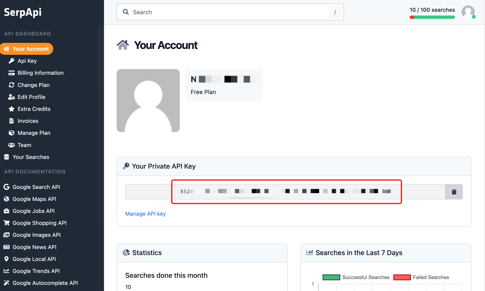
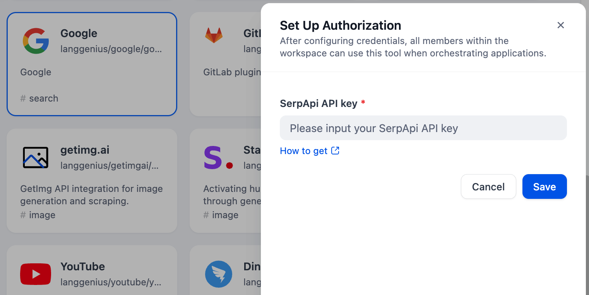

# Google Scholar Search

## Overview

The Google Scholar Search tool is a real-time API that extracts search engine results, providing structured data from Google Scholar by SerpApi.

## Configuration

### 1. Apply for an API Key

Please apply for an API Key on the [SerpApi](https://serpapi.com/dashboard).

### 2. Get Google Scholar tools from Plugin Marketplace

The Google Scholar tools could be found at the Plugin Marketplace, please install it first.

### 3. Fill in the configuration in Dify

On the Dify navigation page, click `Tools > Google Scholar > To authorize` filling in the API Key.

### 4. Use the tool

You can use the Google Scholar tool in the following application types:

#### Chatflow / Workflow applications

Both Chatflow and Workflow applications support adding a Google Scholar tool node.

#### Agent applications

Add the Google Scholar tool in the Agent application, then enter online search instructions to call this tool.

### Repository URL
https://github.com/aopstudio/dify-google-scholar-tool